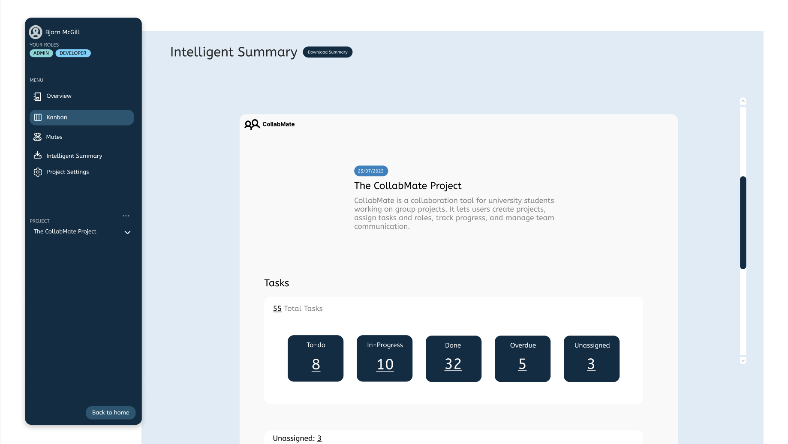

## Hi there 👋

I’m Areeq Imran, a passionate programmer graduated from University of New South Wales.

I have a keen interest in UI/UX Design, Full Stack Development, and exploring low-level programming through languages like C++ and Rust.

## Technologies:
### Languages
* TypeScript / JavaScript
* Python
* C++
* Rust

### Frameworks
* React
* Tailwind
* Flask
* Express

### Databases
* PostgreSQL

## 📂 Project Highlights
> **Note:** Some of these projects are not publicly available due to university policies, but access can be provided upon request.

  

    <strong>Fialka Architects Website</strong> — NextJS Static Site, TailwindCSS — 
    <a href="https://www.fialkabd.com" target="_blank">View Here 🔗</a>
  

- Built a fully responsive static website using **Next.js** and **TailwindCSS**
- Implemented a clean UI/UX design for architecture portfolio
- Deployed and optimized for fast load times

  
<strong>CollabMate — The Smart Student Group Project Tracker</strong> — React, Tailwind, Flask, PostgreSQL

- Full-stack web application to manage student projects (**group project**)
- My contributions: **frontend design**, **database design**, **API integrations**, and selected **backend & frontend implementations**
- **Frontend:** React + TailwindCSS for interactive dashboards
- **Backend:** Flask + PostgreSQL handling user authentication and project data
- Features include task assignment, progress tracking, and notifications

### UI Highlights / Preview

%204.0.png)

  
<strong>Concurrent HTTP/1.1 Proxy</strong> — Python3

- Multi-client concurrent HTTP/1.1 proxy supporting GET, POST, HEAD, CONNECT
- Implemented connection persistence, logging, and multithreading
- Built using only low-level socket programming in Python

  <strong>AI Armageddon (Prototype Game) - Day of AI Australia 2025 Submission</strong> - React, PhaserJS -
  <a href="https://star-slayer-project.vercel.app" target="_blank">View Here 🔗</a>

- Developed in collaboration with [Briyan Biju](https://github.com/MundaneDragon)
- **Story-driven game prototype** with interactive gameplay to educate on AI literacy
- Focus on **mechanics, design, and systems architecture**  
- Early-stage prototype: core concepts and structure implemented
- View the public repository [here](https://github.com/imareeq/star_slayer_project)

  
<strong>Chip 8 Emulator</strong> — C++ - <a href="https://github.com/imareeq/chip-8-emulator" target="_blank">Github Repository 🔗</a>

- Developed a full-cycle Chip-8 emulator in C++ implementing the core instruction set (35 opcodes), virtual memory, the graphics rendering, and all other underlying functionalities.
- Integrated SDL3 for hardware-accelerated graphics rendering and real-time keyboard input mapping.
- Gained deep insight into the Fetch-Decode-Execute cycle and low-level memory management.

  
<strong>Filtered String View</strong> — C++

- Implemented a **filtered string view** providing a read-only view into existing character data  
- Supports optional **predicate-based filtering** of visible characters  
- Wrote **bidirectional iterators** for traversal  
- Ensured **const-correctness, exception safety, and modern C++ practices**  

  
<strong>General Directed Weighted Graph</strong> — C++

- Implemented a generic directed weighted graph using **templates**  
- Wrote **bidirectional iterators** for nodes and edges  
- Utilized **dynamic polymorphism** for weighted/unweighted edges  
- Applied **modern C++ practices**, including RAII and smart pointers  

## 🔨 Currently Building

<strong>Cumulonimbus — The Smart Study Buddy</strong> - Electron, React, TypeScript

- Local **study management app** using SQLite for embedded storage  
- Features: **task tracking, study sessions, progress monitoring, AI quizzes and flash cards**  
- Focused on **user-friendly UI, local-first design, and lightweight architecture**  
- Open source after completion of first MVP.

### UI Mockup / Preview

.png)

<strong>Lightweight Project Management Discord Bot</strong> - TypeScript 

- Discord bot for **simple project and task management**  
- Implements **commands for creating tasks, tracking progress, and notifications**  
- Focus on **automation, efficiency, and user-friendly interactions**  
- Open source after completion of first MVP.

