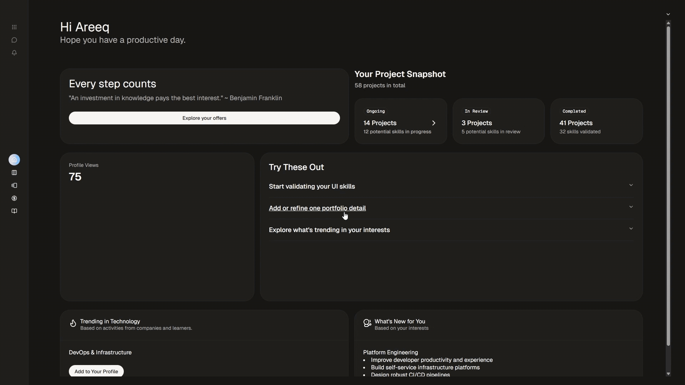
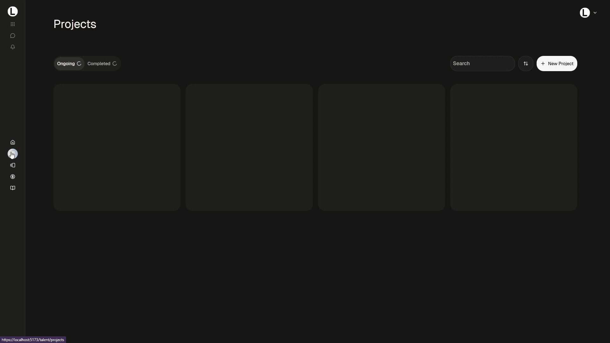
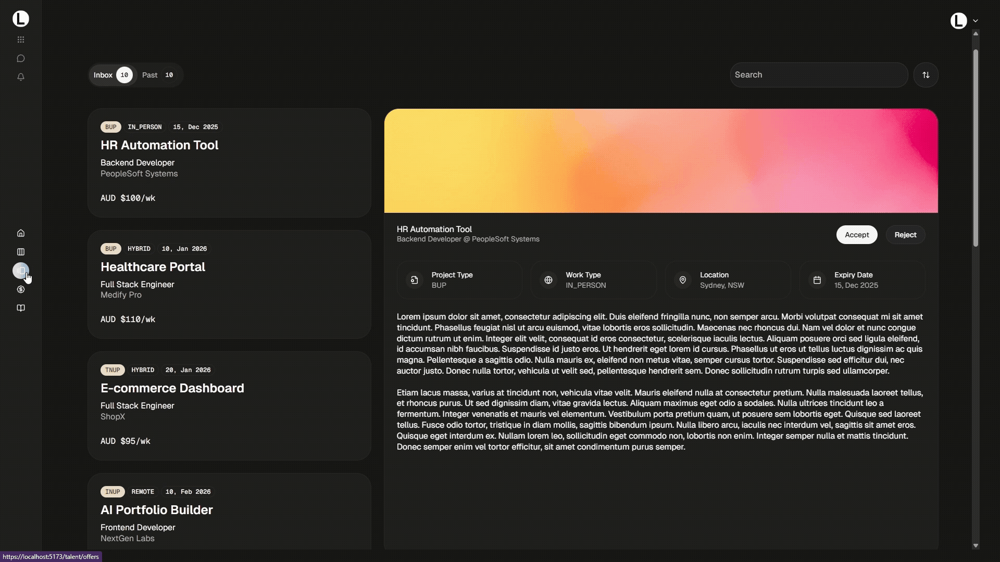
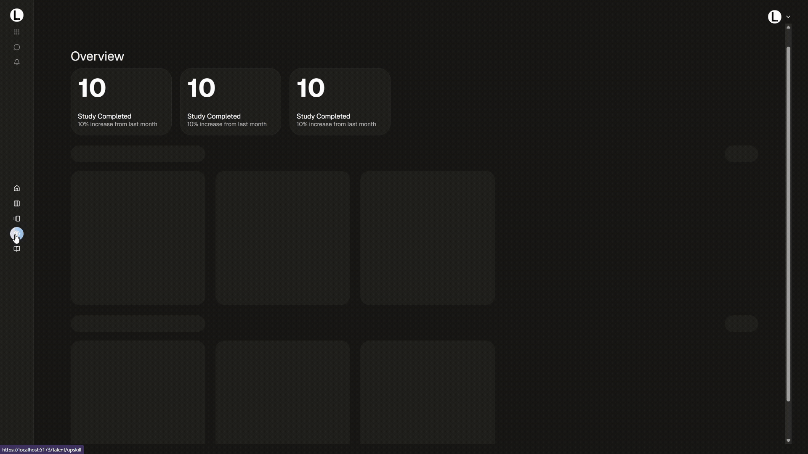
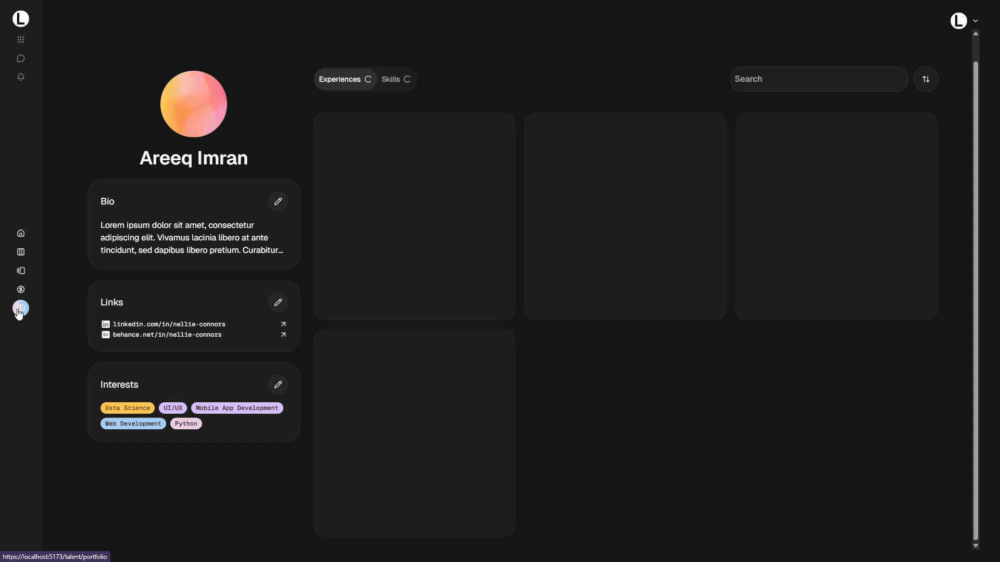
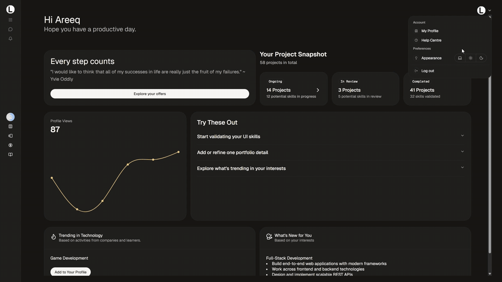
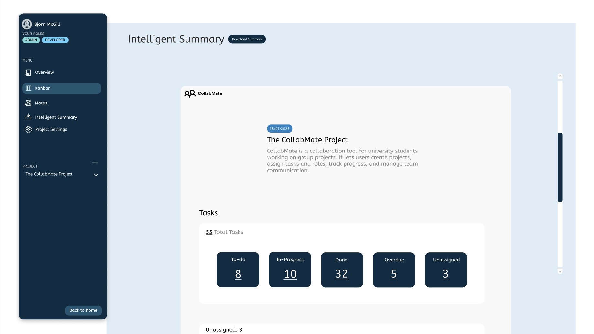

## Hi there

I’m Areeq Imran, a recent Software Engineering graduate from UNSW Sydney. I enjoy building scalable, performant, elegant, and user-friendly applications.

## Technologies:

### Languages

- TypeScript / JavaScript
- Python
- C++
- Rust
- Go

### Libraries and Frameworks

- React
- NextJS
- Tanstack Start
- Tailwind
- Flask
- Express
- tRPC
- SDL3

### Databases

- PostgreSQL

### Tools

- Docker
- AWS (Terraform & S3)
- Cloudflare
- Git
- CMake

## Professional Experience

  
<strong>Software Engineer - Ladder Inc</strong> — Express, React, Tanstack (Query/Router) S3, Terraform, Cloudflare, Supabase, PostgreSQL

- Developed a scalable frontend using React and TanStack (Router/Query), optimizing data fetching strategies via code-splitting and caching to reduce latency across the application.
- Automated infrastructure deployment with Terraform and AWS, setting up CI/CD pipelines for Dev, Staging, and Production environments to ensure reliable, zero-downtime releases.
- Implemented comprehensive security measures including token-based authentication (PKCE), CSRF protection, and XSS prevention while leveraging Cloudflare for bot mitigation across authentication layers.
- Contributed to backend architecture decisions including database schema design, authentication infrastructure selection, and migrating the development environment to HTTPS.
- Served as Lead Frontend Engineer, managing task delegation and performing code reviews for two interns to maintain engineering standards within sprint timelines.

### UI Preview (Implementations)

#### Login and Onboarding
https://github.com/user-attachments/assets/c4d2572a-0819-458b-8029-8ce5d010858a

#### Dashboard

#### 

#### Projects

#### 

#### Offers

#### 

#### Upskilling

#### 

#### Portfolio

#### 

#### Light/Dark Mode and Account Preferences

#### 

## Project Highlights

> **Note:** Below are some of my personal/university projects. A few are private due to university restrictions, but I’m happy to share the code upon request.

### Full-Stack Web Apps

  

    <strong>Airtable Clone</strong> - Next.js, TypeScript, tRPC, Prisma, PostgreSQL, ShadCN - 
    <a href="https://airtable-clone-ecru-psi.vercel.app" target="_blank">View Here (Google Sign in only) 🔗</a>
  

  - Architected a dynamic schema engine to model user-generated spreadsheets in PostgreSQL while enforcing end-to-end type safety and robust SQL injection prevention measures.
  - Achieved a 50% reduction in bulk data insertion latency (from average 20s to 10s) for 100k+ rows by implementing optimized Prisma transactions and batch-processing strategies.
  - Implemented high-performance fuzzy search using Trigram and GIN indices, supporting complex column-wise filtering and sorting across millions of rows without degradation.
  - Developed a responsive spreadsheet UI featuring TanStack Table with row virtualization, hybrid infinite scrolling, and optimistic updates to ensure zero-lag UX.

  

    <strong>Fialka Architects Website</strong> — NextJS Static Site, TailwindCSS — 
    <a href="https://www.fialkabd.com" target="_blank">View Here 🔗</a>
  

- Built a fully responsive static website using **Next.js** and **TailwindCSS**
- Implemented a clean UI/UX design for architecture portfolio
- Deployed and optimized for fast load times

  
<strong>CollabMate — The Smart Student Group Project Tracker</strong> — React, Tailwind, Flask, PostgreSQL, FirebaseAuth

- Full-stack web application to manage student projects (**group project**)
- My contributions: **frontend design**, **database design**, **API integrations**, and selected **backend & frontend implementations**
- **Frontend:** React + TailwindCSS for interactive dashboards
- **Backend:** Flask + PostgreSQL handling user authentication and project data
- Features include task assignment, progress tracking, and notifications

### UI Highlights / Preview

%204.0.png>)

  <strong>AI Armageddon (Prototype Game) - Day of AI Australia 2025 Submission</strong> - React, PhaserJS -
  <a href="https://star-slayer-project.vercel.app" target="_blank">View Here 🔗</a>

- Demo video [here](https://www.youtube.com/watch?v=X83Cm85O7lI)
- Developed in collaboration with [Briyan Biju](https://github.com/MundaneDragon)
- **Story-driven game prototype** with interactive gameplay to educate on AI literacy
- Focus on **mechanics, design, and systems architecture**
- Early-stage prototype: core concepts and structure implemented
- View the public repository [here](https://github.com/imareeq/star_slayer_project)

<strong>Cumulonimbus — The Smart Study Buddy (Concept)</strong> - Electron, React, TypeScript

- Local **study management app** using SQLite for embedded storage
- Features: **task tracking, study sessions, progress monitoring, AI quizzes and flash cards**
- Focused on **user-friendly UI, local-first design, and lightweight architecture**
- Open source after completion of first MVP.

### UI Mockup / Preview

.png>)

### Systems & Low-Level Programming

  
<strong>Concurrent HTTP/1.1 Proxy</strong> — Python3

- Multi-client concurrent HTTP/1.1 proxy supporting GET, POST, HEAD, CONNECT
- Implemented connection persistence, logging, and multithreading
- Built using only low-level socket programming in Python

  
<strong>Chip 8 Emulator</strong> — C++ - <a href="https://github.com/imareeq/chip-8-emulator" target="_blank">Github Repository 🔗</a>

- Developed a full-cycle Chip-8 emulator in C++ implementing the core instruction set (35 opcodes), virtual memory, the graphics rendering, and all other underlying functionalities.
- Integrated SDL3 for hardware-accelerated graphics rendering and real-time keyboard input mapping.
- Gained deep insight into the Fetch-Decode-Execute cycle and low-level memory management.

  
<strong>Filtered String View</strong> — C++

- Implemented a **filtered string view** providing a read-only view into existing character data
- Supports optional **predicate-based filtering** of visible characters
- Wrote **bidirectional iterators** for traversal
- Ensured **const-correctness, exception safety, and modern C++ practices**

  
<strong>General Directed Weighted Graph</strong> — C++

- Implemented a generic directed weighted graph using **templates**
- Wrote **bidirectional iterators** for nodes and edges
- Utilized **dynamic polymorphism** for weighted/unweighted edges
- Applied **modern C++ practices**, including RAII and smart pointers

  
<strong>RSheet - Concurrent Spreadsheet Server</strong> — Rust

- Architected and implemented a concurrent multi-client spreadsheet server supporting atomic get/set operations,
  dependency graphs, and background propagation across multi-layered cell formulas using Rust’s ownership
  model.

